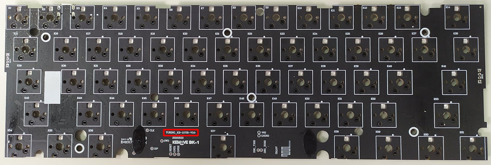
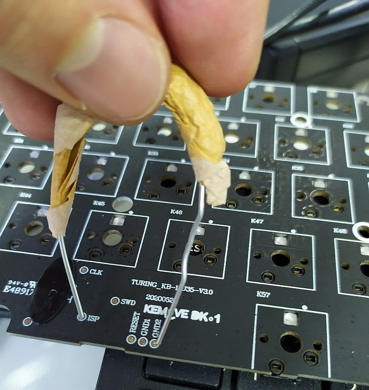

# How to install

## Before you begin

**Check your keyboard's PCB version.** The current version of Open Kemove only supports keyboards featuring PCB revision 3.0. If you have 1.2 or 1.5, we are working on a port for you (more info about this on our [Discord server](https://discord.gg/TFeG4cb3yk)). To check which version you have, disassemble your keyboard and examine the lower part of the PCB

<details>

</details>
**Have a backup keyboard available.** During the disassembly and flashing procedures, you will need to input some keystrokes. Even though an on-screen keyboard will make do, we do not recommend it :D

**Follow these steps carefully.** Make sure to not skip the step for backing up the original firmware, in case you need to recover your keyboard to its original state.

**Understand how it works.** Please review the [How it all works]() page. In the off chance that things go wrong, at least you will know what to google and how to ask for help. The [Discord server](https://discord.gg/TFeG4cb3yk) is a great place to ask for support, as people are always helpful there.

## Step 1: Set up your environment

We will assume you have Windows 10 and have WSL or WSL2 installed. If not please install that. We will have tags that explain what you need to do differently for certain sections of the instruction.

### ARM GCC Compiler / Toolchain

This is often a package in your package manager. On Ubuntu this can be done using
```bash
sudo apt install gcc-arm-none-eabi binutils-arm-none-eabi make
```

### Git
```bash
sudo apt install git
```

### DFU-Tools

For linux users, we strongly recommend the `dfu-util` tool to flash the firmware. If you run into permission problems you can always create udev rules, or simply run the tool using sudo.

```bash
sudo apt install dfu-util
```

**NOTE: Do not run this under WSL it will not work. WSL has no USB support as of 2020**

## Step 2: Get the bootloader

Simply download the version matching your PCB revision from:

[Jenkins CI Server](https://ci.codetector.org/job/OpenKemove/job/kemove_lpc_dfu/job/master/)
Download the `lpc_boot_Vxx.bin` where xx is your version. For example 1.5 would be 1_5.

**OR You can build the bootloader yourself**
<details>

### Clone bootloader repository

```bash
git clone https://github.com/OpenKemove/kemove_lpc_dfu.git --recursive --depth=1
```

`recursive` here will tell git to clone all submodules.

`depth=1` will tell git to not clone history. You can omit this if you planning on developing the firmware.

### Compile bootloader

```bash
cd kemove_lpc_dfu
make
```
Yep, that's it. simple. Hopefully it has successfully built with no errors.
You should see a few files under build. Namely `lpc_boot_v3/v1_5.bin`
</details>


## Step 3: Build QMK firmware

### Clone our QMK Fork

```bash
git clone https://github.com/OpenKemove/qmk_firmware.git --recursive --depth=1
```

### Compile QMK

```bash
cd qmk_firmware
make kemove/snowfox/v3
```

If you have 1.5 please replace `v3` with `v1_5`

Once this is done, you should see a `kemove_snowfox_vxx_default.bin` in the directory.

## Step 4: Disassemble your keyboard

With your keyboard disconnected from the computer, remove all keycaps and switches using the pullers provided by Kemove.

You will also need to remove the 7 screws fixing the PCB to the keyboard's case. These screws have soft heads, so use an adequate sized phillips screwdriver, otherwise you may end up with very difficult to remove dusted screws.

When lifting the PCB from the case, gently detach the wire connecting the battery to the back of the PCB. You will have a bare board like the one below.



## Step 5: Connect the PCB in flash drive mode

To execute this step you will need to close a circuit in your PCB using either a resistor (100-1K Ohm is better), a wire or a paper clip, so gather one of these tools.

Looking at the PCB's front (the side that swiches would be installed onto), you will find some exposed metal contacts. These are called test points. First locate a test point with the `ISP` description next to it. Then locate the test points with the `GNDx` description (where `x` could be any number).

Next, using your resistor, wire or paper clip, connect the `ISP` metal contact to any one of the `GNDx` contacts. While holding this connection, plugin the PCB to a computer using the keyboard's USB cable. If you did everything correctly, a new "flash drive" should show up on the computer (and you can drop the wire contacts). Otherwise, you probably did not connect the `ISP` and `GNDx` pads properly, so please try again.

Below is an example of a rudimentary paper clip connection closing the circuit between the `ISP` and `GND2` test points.



## Step 6: Backup original firmware and place bootloader

>**Attention Linux users:** This step might require using a Windows machine or VM, or MacOS, as it often have problems on Linux. But feel free to also try the MacOS steps at the end of this section.

With the PCB connected as a "flash drive", open it in Explorer and locate the `firmware.bin` file. This is the original firmware provided by Kemove and it should be 64 KB in size. Copy this file to a safe place in your computer, as you will revert to this backup in case anything goes wrong during the flashing procedure.

After certifying that you backed up the original firmware, delete the `firmware.bin` file from the "flash drive". Then copy the `lpc_boot.bin` bootloader file that you compiled in step 1 to the "flash drive". There is no need to rename it.

Once you are done with that, unplug the PCB from the computer. Place a single switch in the `ESC` key slot and hold it down while replugging the board to the computer. This will trigger *Device Firmware Upgrade* (DFU) mode and, if you check your computer's `Device Manager`/`lsusb`, you should see a new `DFU` device in there.

### Instructions for MacOS users

Please **DO NOT** open the flash drive in Finder. Instead, complete the operation using the command line interface. You can do this with the following steps:

0. Wait for the drive icon to show up in desktop.
0. Open a terminal
0. `cd ` (space after `cd`) then drag the drive icon into your terminal. It should fill in the path. Then press enter.
0.  ```bash
    rm -rf firmware.bin
    sync
    ```
0. `cp PATH_TO_LPC_BOOT.BIN .` (You can do the drag and drop thing as well for `lpc_boot.bin`)
0. `sync`
0. `diskutil list`, then find the diskX where X is a number which contains the flash drive.
0. `diskutil unmountDisk diskX` this is the diskX you found in the previous step.

## Step 7: Flash QMK!

Now we can use dfu-util to flash the device. Run `dfu-util` in the
`qmk_firmware` directory. Make sure it can detect the device. You can verify this by running. Check for the pair *feed:6969*.

**Note: Windows Users** Please follow [This Guide](https://www.hanselman.com/blog/how-to-fix-dfuutil-stm-winusb-zadig-bootloaders-and-other-firmware-flashing-issues-on-windows) on how to install the generic libusb driver


```bash
dfu-util -l
```
you should see something like this:
```bash
dfu-util 0.9

Copyright 2005-2009 Weston Schmidt, Harald Welte and OpenMoko Inc.
Copyright 2010-2016 Tormod Volden and Stefan Schmidt
This program is Free Software and has ABSOLUTELY NO WARRANTY
Please report bugs to http://sourceforge.net/p/dfu-util/tickets/

Found DFU: [feed:6969] ver=0200, devnum=4, cfg=1, intf=0, path="1-12", alt=0, name="UNKNOWN", serial="604"
```
Then you can flash the firmware by using
```bash
dfu-util -d feed:6969 -D kemove_snowfox_vxx_default.bin
```
If you run into any error, please try connecting the keyboard directly to
the computer without any HUB etc. Or just try a few times. Remeber to unplug / replug (while holding esc) between tries.

Once it is done, you board should be running QMK. (you might need to unplug / replug) for it to boot QMK. The auto boot works most of the time but occasionally seems buggy.
